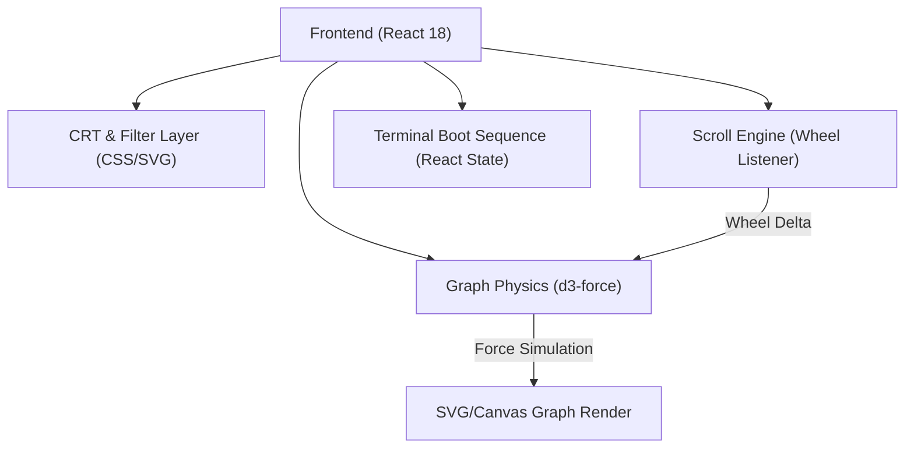

## 1. 架构设计


## 2. 技术说明
- **前端框架**: React 18 + Vite + Tailwind CSS
- **图谱渲染与物理引擎**:
  - `d3-force`: 核心物理引擎。
  - 通过监听全局 `wheel` 事件，动态修改 `d3-force` 的 `forceManyBody` (斥力) 和 `forceLink` (连线距离) 参数，并在修改后调用 `simulation.alpha(1).restart()` 来实现“滚轮铺开打结图谱”的徐徐展开动画。
- **视觉特效 (CRT & Terminal)**:
  - 启动序列：使用 React `useEffect` 和简单的打字机效果 (Typewriter hook) 模拟 "Cognitive Kernel Booting..."。
  - 扫描线 (Scanlines)：使用 CSS `repeating-linear-gradient` 配合 `@keyframes` 动画实现。
  - 暗角 (Vignette) 与 闪烁 (Flicker)：绝对定位的 overlay，CSS `box-shadow: inset` 实现暗角，`opacity` 的随机关键帧动画实现电流闪烁。
- **交互控制**:
  - `document.body.style.overflow = 'hidden'` 彻底禁用原生滚动。
  - 监听 `onWheel`，将滚轮增量（deltaY）映射为图谱的“展开度”状态变量 (unfoldProgress，从 0 到 1)。

## 3. 路由定义
| 路由 | 目的 |
|-------|---------|
| `/` | 唯一的入口，包含启动层、CRT层、图谱层 |

## 4. 数据模型
```typescript
interface GraphNode {
  id: string;
  label: string;
  address: string; // 诸如 ADDR_0x0A1
  group: 'large' | 'small';
  radius: number;
}

interface GraphLink {
  source: string;
  target: string;
}
```